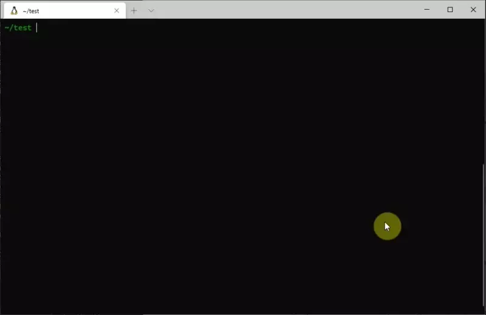

# create-cpp-class

A [Node.js](www.nodejs.org) CLI to bootstrap the process of creating C++ classes



## Prerequisites

[Node.js](nodejs.org) and [npm](npmjs.com)

## Install

```
npm install -g @everettblakley/create-cpp-class
```

## Disclaimer

This package will create files, and potentially directories, within your file system. Currently, the program will determine the files that it needs to create, and will copy over the required templates, overwriting any files that have the same name. The program will show you the files that it is going to generate, and ask if that looks right to you. It will not check if the file already exists, so be careful to not specify a class that already exists, or it will be over written.

The program will display a disclaimer before it runs, just to be sure you are aware:

```
  DISCLAIMER
Be aware that this program will overwrite any files that match any files specified in the output. You will have an opportunity to abort before any writes occur. Please be aware of the values you use.
? Proceed with this program? (Y/n)
```

## Usage

This CLI will create a C++ class based on parameters you pass in, combined with some user input on the command line. 

### Basic Usage

Without any arguments, the CLI will walk you through all the prompts, and ask what you want to name the class, and everything else.

```
create-cpp-class
```

This will ask you the following questions regarding the new class:

1. Do you accept the terms of the [Disclaimer](#Disclaimer)

2. The name of the class you want to create

   - Some notes about class names:
     - Note that spaces will be ignored on input
     - Class can only contain A-Z (lowercase or uppercase), 0-9, and underscores(_)
     - Any errors will display a message

3. The output directory of the header file (default is `./include`)

4. The file extension of the header file (default is `.h`, other options are `.hpp` and`None`

5. If you want to include a source file for class implementation (default is `yes`). If so, then it will ask:

   1. The output directory of the source fill (default is `./src`)
   2. The file extension of the source file (default is `.cpp`, other options are `.cc` and `.cxx`)

6. The CLI will display the files that it is going to create based on your options, and ask you if you want to continue. (default is `yes`)

Then the CLI will process your configuration, create the files, and populate them with the relevant information!

To see the templates used for the `header` and `source` files, see the respective files [here](https://github.com/everettblakley/create-cpp-class/tree/master/templates)

### Accept Defaults: `--yes` (`-y`)

To accept all defaults and simply run the creation script, use `--yes` (or `-y`)

```
create-cpp-class --yes
```

This will use all defaults (listed [here](#defaults)), but will still ask for a class name (unless you [declare a class name](#Declare class name))

### Declare class name: `--class-name`(`-c`)

If you don't want to go through the class name prompts, you can use the `--class-name` (or `-c`) arg to pass it in. The class name should follow the conditions laid out in the [basic usage](#Basic Usage), else you will be required to input one from the prompts. 

```
create-cpp-class -c AwesomeClassName
```

This will still require you to agree to the [disclaimer](#Disclaimer), and to set the appropriate header/source file and extensions, unless used with the [accept defaults flag](#Accept Defaults: --yes (-y)) 

### Exclude Source Files: `--no-source` (`-n`)

If you don't want to use a separate file for class implementation (i.e. have the class all contained in the header file), pass in the `--no-source` (or `-n`) flag and these prompts will be skipped. You will still need to to agree to the [disclaimer](#Disclaimer), and set appropriate header extension and locations, unless used with the  [accept defaults flag](#Accept Defaults: --yes (-y)) 

### Dry Run: `--dry-run` (`-d`)

If you just want to see what the CLI will produce, use the `--dry-run` (or `-d`) flag. This will bypass the [disclaimer](#Disclaimer) , but you will still need to answer the other prompts, unless used with the  [accept defaults flag](#Accept Defaults: --yes (-y)) . **NO FILES WILL BE WRITTEN TO YOUR DISK WITH THIS COMMAND**

### Advanced Usage

If you don't like all the prompts, or you find that you don't need to specify the header extensions and locations every time, use the following command to get through it faster

```
create-cpp-class -y -c AwesomeClassName
```

This will create the following files:

```
./
| -> include/AwesomeClassName.h
| -> src/AwesomeClassName.cpp
```

To see what this command will output before committing to it, just run `create-cpp-class -y -c AwesomeClassName -d`

### Defaults

The default settings define the class in a header file, with a source file (or implementation) containing class implementations. The default header file extension is `.h` and the default source file extension is `.cpp`, with the header being placed in a directory called `include` and source being placed in a directory called `src`

# Authors

This code was written while procrastinating an assignment by [Everett Blakley](http://everettblakley.ca)

# Contribution

Contributions are welcome via pull-requests to the master branch

# License

This project is using the a standard [MIT License](https://github.com/everettblakley/create-cpp-class/tree/master/LICENSE)